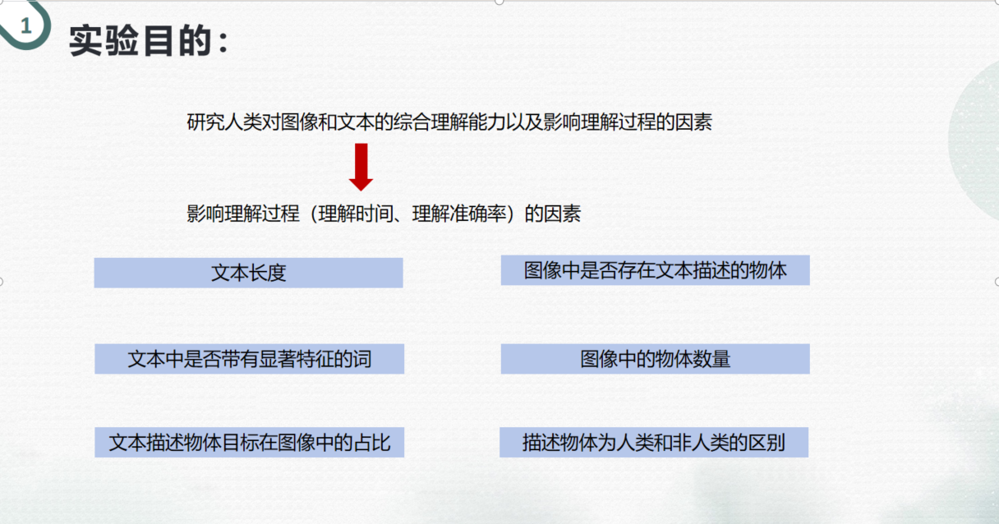
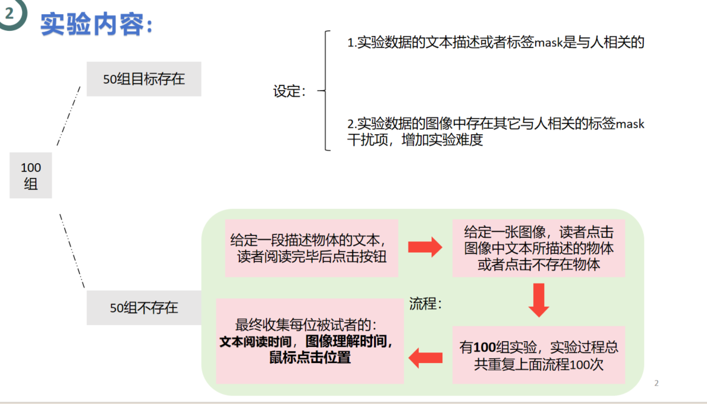
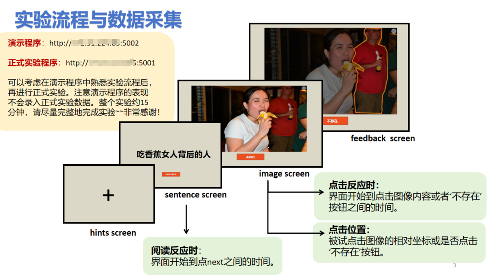

# Simple-behavior-experiment-online-program
本 repo 包含一个简单的在线行为实验程序，用于采集被试视觉搜索目标时的行为数据。本实验程序使用 Flask框架编写和使用了COCO数据集作为实验材料，可以部署到服务器上供被试在线使用。

## 实验目的

## 实验内容


## 实验步骤


### 程序安装
需要python3.8以及相应的依赖包
程序比较简单，可能其他版本也可以~~

```sh
pip install -r requirements.txt
```

### 运行程序
运行正式实验程序
```sh
python app.py
```
演示实验程序
```sh
cd demo_experiment
python app.py
```

### 引用

- **COCO 数据集**: 实验使用了 Microsoft COCO 数据集。COCO 数据集是一个广泛用于图像识别、分割和标注的数据集，它包含了大量的标记和分类的图像。更多信息可以在 [COCO 数据集官网](http://cocodataset.org/) 查询。
- **GrefCOCO 数据集**: 实验使用了 [GrefCOCO 数据集](https://github.com/henghuiding/gRefCOCO)，这是一个基于 Microsoft COCO 数据集的扩展。
- **YoloV8模型**。本项目使用了 [YoloV8](https://github.com/ultralytics/ultralytics) 模型在实验分析中目标检测来测算 bbox 的位置、大小、类别。